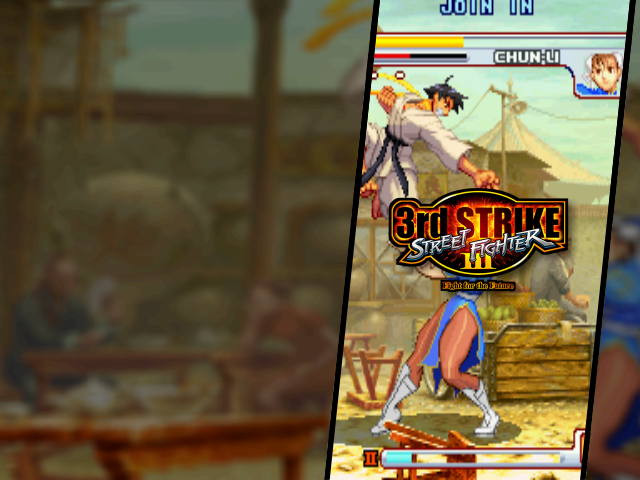
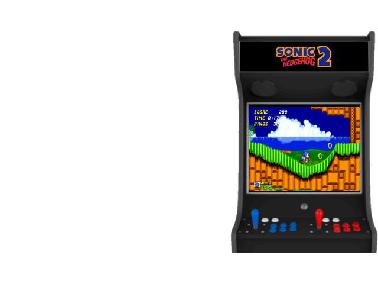
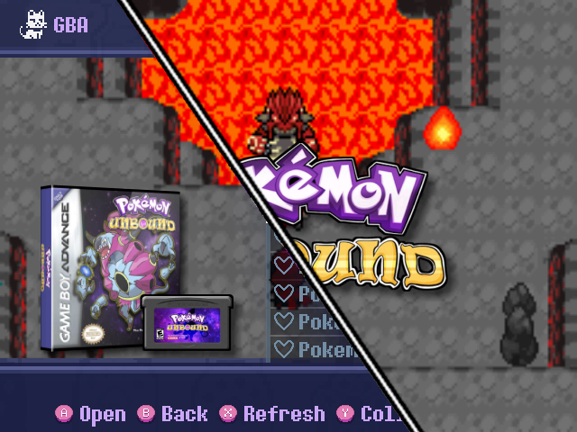

## 640x480 Templates

| **Preview** | **Details** |
|-------------|-------------|
|  | **Template**: Epic Gradient   **Author**: @Mntz   **Date of Submission**: 2025-03-13   **Download**: [Epic.Gradient.Scraper.zip](files/Epic.Gradient.Scraper.zip)       |

| **Preview** | **Details** |
|-------------|-------------|
|  | **Template**: Box Screenshot Window   **Author**: elav (ported from jdcross)   **Date of Submission**: 2025-03-14   **Download**: [box-window-jdcross.zip](files/box-window-jdcross.zip)       |

| **Preview** | **Details** |
|-------------|------------|
|  | **Template**: Loading Splash Screen   **Author**: joyrider3774   **Date of Submission**: 2025-03-16   **Download**: [loading-splash.zip](files/loading-splash.zip)       |

| **Preview** | **Details** |
|-------------|------------|
|  | **Template**: Arcade Machine   **Author**: joyrider3774   **Description**: Displays screenshots and wheels as an arcade machine. Requires Scrappy version >= 2.3.0   **Date of Submission**: 2025-03-29   **Download**: [Arcade-machine.zip](files/Arcade-machine.zip)       |

| **Preview** | **Details** |
|-------------|-------------|
|  | **Template**: Box3d Fullscreen Splash Left   **Description**: Profile for themes with the gamelist on the right. Includes 3D Box Art, Preview, Game Cartridge/Disc, and Fullscreen Splash on launch.  **Author**: [ngencokamin](https://github.com/ngencokamin) (@rbenv on Discord)   **Date of Submission**: 2025-03-21   **Download**: [box3d-full-splash-preview-left.muxzip](files/box3d-full-splash-preview-left.muxzip)   **Extra Steps**: In the Customization section of the settings menu, set "Content Box Art" to "Behind" and "Content Box Art Alignment" to "Middle Left"   **Assets Used**: Screenshot, Cover, Wheel, Textures            |

| **Preview** | **Details** |
|-------------|------------|
|  | **Template**: boxart + screenshot   **Author**: joyrider3774   **Description**: Displays Boxart and screenshot always centered and keeping aspect ratio. Requires Scrappy version >= 2.3.0   **Date of Submission**: 2025-03-29   **Download**: [boxart+screenshot.zip](files/boxart+screenshot.zip)       |