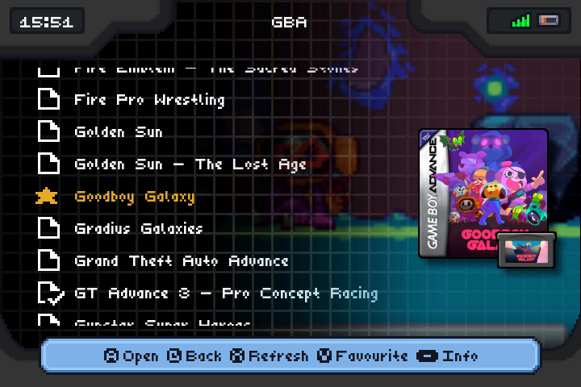
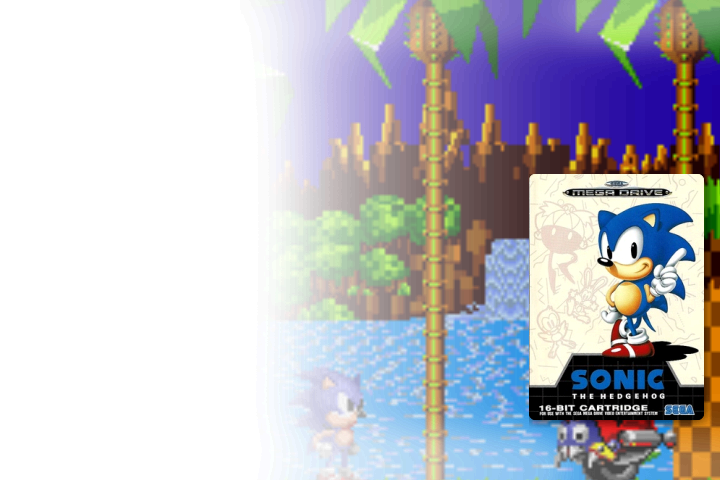
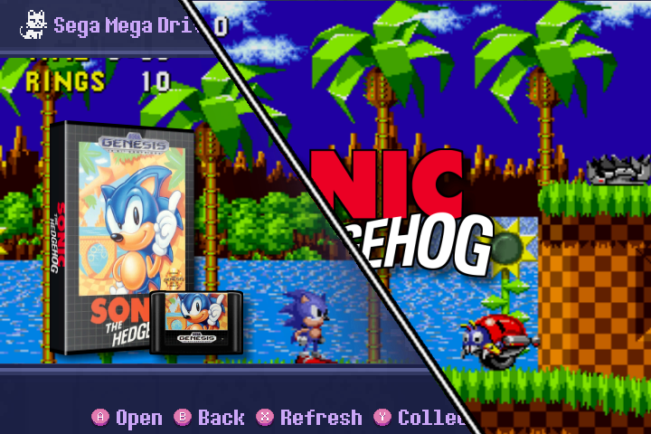

## 720x480 Templates

| **Preview** | **Details** |
|-------------|-------------|
|  | **Template**: MuOS Advance   **Author**: elav   **Date of Submission**: 2025-03-13   **Download**: [MuOS_Advance.zip](files/MuOS_Advance.zip)       |

| **Preview** | **Details** |
|-------------|-------------|
|  | **Template**: Epic Gradient   **Author**: @Mntz   **Date of Submission**: 2025-03-13   **Download**: [Epic.Gradient.Scraper-RG34XX.zip](files/Epic.Gradient.Scraper-RG34XX.zip)       |

| **Preview** | **Details** |
|-------------|-------------|
|  | **Template**: Box3d Fullscreen Splash Left   **Description**: Profile for themes with the gamelist on the right. Includes 3D Box Art, Preview, Game Cartridge/Disc, and Fullscreen Splash on launch.  **Author**: [ngencokamin](https://github.com/ngencokamin) (@rbenv on Discord)   **Date of Submission**: 2025-03-21   **Download**: [box3d-full-splash-preview-left.muxzip](files/box3d-full-splash-preview-left.muxzip)   **Extra Steps**: In the Customization section of the settings menu, set "Content Box Art" to "Behind" and "Content Box Art Alignment" to "Middle Left"   **Assets Used**: Screenshot, Cover, Wheel, Textures            |